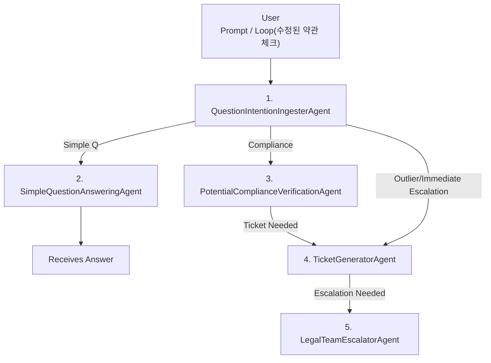

# QARouting.ai: Agentic AI Engineer Technical Assignment (Task 3)

---

## 📝 과제 개요

본 프로젝트는 "Agentic AI Engineer Technical Assignment"의 **Task 3: Autonomous Document QA & Routing** 요구사항을 실무 수준으로 구현한 솔루션입니다.

> **과제 목표:**  
> - 문서(PDF/Markdown) 입력 → 도메인 특화 질의응답(QA) → 컴플라이언스 이슈 탐지 → 컨텍스트 기반 워크플로우(티켓 생성, 에스컬레이션 등) 자동화  
> - **LangGraph 기반 멀티에이전트 워크플로우 설계 및 실행**  
> - 에이전트별 역할 분리, 프롬프트 최적화, 그래프형 토폴로지 설계, 자동화된 평가 및 테스트 케이스 제공

---

## 📌 LangGraph 기반 구현 특징

- **LangGraph**는 현대적 멀티에이전트 프레임워크로, 각 에이전트를 노드로 정의하고, 분기/병렬/조건부 실행이 가능한 그래프형 워크플로우를 지원합니다.
- 본 시스템은 LangGraph를 활용하여 `DocumentIngestorAgent`, `SectionClassifierAgent`, `QAAssistantAgent`, `ComplianceDetectorAgent`, `TicketGeneratorAgent`, `EscalationAgent` 등 각 역할별 에이전트를 그래프 노드로 구현하였으며, 데이터 흐름과 분기 로직을 명확하게 시각화 및 자동화하였습니다.
- LangGraph의 유연한 구조 덕분에, 향후 Task 1(코드 리뷰), Task 2(논문 분석) 등 다양한 멀티에이전트 워크플로우로 확장도 용이합니다.

---

## 📌 구현 범위 및 주요 기능

- **문서 자동 수집 및 전처리**: PDF/Markdown 문서에서 텍스트 추출 및 섹션 분할
- **의미 기반 질의응답**: Sentence-BERT 임베딩 기반, 문맥을 이해하는 QA
- **컴플라이언스 이슈 탐지**: 키워드/룰 기반 규정 위반 자동 식별
- **워크플로우 자동 분기**: 이슈 심각도에 따라 티켓 생성/에스컬레이션 자동화
- **테스트 자동화**: 샘플 문서 및 시나리오 기반 end-to-end 평가 스크립트 제공

---

## 🏗️ 시스템 아키텍처 및 에이전트 설계

### 1. 아키텍처 다이어그램


### 2. 에이전트별 역할 및 입출력

| 에이전트                              | 입력                                   | 출력                                   | 주요 역할 설명 |
|----------------------------------------|----------------------------------------|----------------------------------------|----------------|
| QuestionIntentionIngesterAgent         | user_prompt: str                       | route_type: str                        | 사용자의 질문 의도 분류 및 라우팅 결정 |
| SimpleQuestionAnsweringAgent           | question: str                          | answer: str                            | 단순 질의응답 처리 |
| PotentialComplianceVerificationAgent   | question: str                          | compliance_issue: bool, details: str   | 컴플라이언스 관련 이슈 탐지 |
| TicketGeneratorAgent                   | issue_details: str                     | ticket: str                            | 이슈 발생 시 티켓 생성 |
| LegalTeamEscalatorAgent                | ticket: str                            | escalation_notice: str                 | 법무팀 에스컬레이션 처리 |

---

## ⚙️ 설치 및 실행 방법

### 1. 환경 준비
```bash
# 저장소 클론
git clone https://github.com/ysw0421/QARouting.ai.git
cd QARouting.ai

# (권장) 가상환경 생성 및 활성화
python -m venv venv
# Windows: venv\Scripts\activate
# macOS/Linux: source venv/bin/activate

# 패키지 설치
pip install -r requirements.txt
```

### 2. 전체 워크플로우 테스트 실행
```bash
python -m eval.test_workflow
```
- 최초 실행 시 sentence-transformers 모델이 자동 다운로드됩니다.
- 콘솔에서 각 에이전트의 처리 결과(답변, 이슈, 티켓/에스컬레이션)를 확인할 수 있습니다.

---

## 🧪 평가 및 테스트 시나리오

### [과제 요구] 공식 테스트 케이스 매핑

- **Test Case 1: Technical Documentation QA**
    - 입력: API 문서 (PDF)
    - 기대 결과: API 질의응답, 구현 문의 라우팅, 문서 업데이트 티켓 생성 등
- **Test Case 2: Legal Document Processing**
    - 입력: 약관(Markdown)
    - 기대 결과: 컴플라이언스 질의응답, 이슈 자동 탐지 및 티켓/에스컬레이션
- **Test Case 3: Customer Support Document Routing**
    - 입력: 제품 매뉴얼
    - 기대 결과: FAQ 답변, 복잡 이슈 티켓화, 적절한 지원팀 라우팅
- **Edge Case: Multi-Language Document**
    - 입력: 다국어(영/일) 혼합 문서
    - 기대 결과: 언어별 답변, 용어 처리, 팀별 라우팅 등

### [실제 구현] 샘플 테스트 방법
- `data/sample_document.md` 파일 및 `eval/test_workflow.py` 스크립트 활용
- 다양한 질문/이슈/섹션이 포함된 문서로 end-to-end 자동 평가 가능

---

## 🛠️ 실무적 한계 및 확장 방향

- **한계**
    - 현재는 룰/키워드 기반 컴플라이언스 탐지(ML 기반 확장 가능)
    - PDF 파싱/다국어 처리 등은 기본 수준(고도화 필요)
    - API/웹 연동, 실시간 알림 등은 미구현(확장 가능)
- **확장 방향**
    - Task 1, 2(코드 리뷰, 논문 분석)로의 멀티에이전트 확장
    - FastAPI/Streamlit 기반 API 및 웹 데모 추가
    - 평가 자동화, 벤치마크 데이터셋 다양화
    - LLM 기반 프롬프트 최적화 및 에이전트 협업 강화

---

## 📄 라이선스

MIT License (LICENSE 파일 참조) 