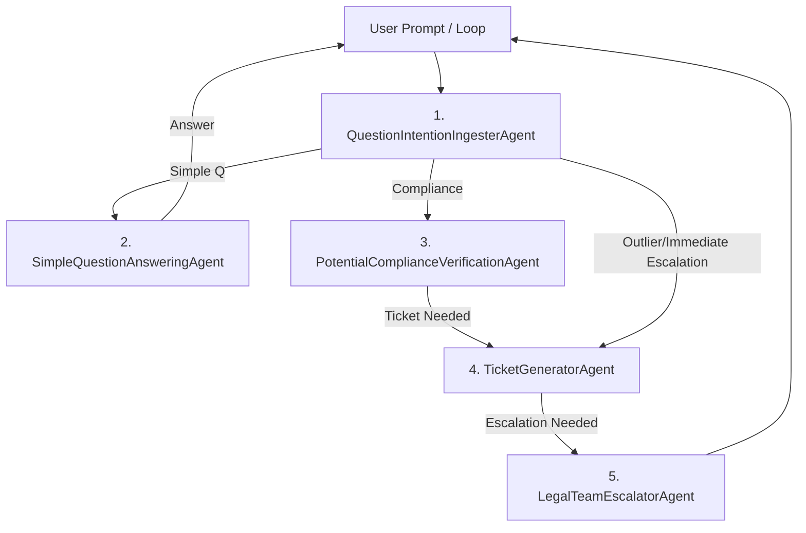

# AutoRouting.ai

> Production-Ready Multi-Agent Document QA & Routing Platform

---

## System Architecture



---

## Directory Structure

```plaintext
AutoRouting.ai/
├── agents/
│   ├── base_agent.py
│   ├── document_qa.py
│   ├── legal_team_escalator.py
│   ├── potential_compliance_verification.py
│   ├── question_intention_ingester.py
│   ├── simple_question_answering.py
│   ├── terms_check_bot.py
│   └── ticket_generator.py
├── data/
│   ├── complex_legal_questions.json
│   ├── legal_team_departments.json
│   ├── modified_terms.md
│   ├── sample_openai.md
│   └── simple_legal_questions.json
├── demo/
│   ├── api_server.py
│   └── main.py
├── eval/
│   ├── benchmark_runner.py
│   ├── generate_benchmark_cases.py
│   └── test_workflow.py
├── frontend/
│   ├── package.json
│   ├── package-lock.json
│   ├── public/
│   │   ├── favicon.ico
│   │   ├── index.html
│   │   ├── logo192.png
│   │   ├── logo512.png
│   │   ├── manifest.json
│   │   └── robots.txt
│   └── src/
│       ├── App.css
│       ├── App.js
│       ├── App.test.js
│       ├── api.js
│       ├── components/
│       │   ├── editor/
│       │   │   ├── BlockEditor.jsx
│       │   │   └── NotionBlock.jsx
│       │   ├── input/
│       │   │   ├── FileList.jsx
│       │   │   └── WorkflowRunner.jsx
│       │   ├── result/
│       │   │   ├── BenchmarkResult.jsx
│       │   │   └── ResultDetail.jsx
│       │   └── visualization/
│       │       ├── NotionReport.jsx
│       │       └── TopologyDiagram.jsx
│       ├── hooks/
│       │   └── useBlocks.js
│       ├── index.css
│       ├── index.js
│       ├── logo.svg
│       ├── reportWebVitals.js
│       ├── service-worker.js
│       ├── serviceWorkerRegistration.js
│       └── setupTests.js
├── results/
│   └── 20240716T100000_user_123456.json
├── scripts/
│   └── langgraph_workflow.py
├── tests/
│   └── test.py
├── uploads/
├── utils/
│   ├── openai_utils.py
│   └── pdf_ingest.py
├── requirements.txt
├── Dockerfile
├── docker-compose.yml
├── .env.example
├── .gitignore
└── README.md
```

---

## .env.example

```env
OPENAI_API_KEY=sk-...
POSTGRES_HOST=db
POSTGRES_PORT=5432
POSTGRES_USER=postgres
POSTGRES_PASSWORD=postgres
POSTGRES_DB=autorouting
REDIS_URL=redis://redis:6379/0
SMTP_USER=your@email.com
SMTP_PASSWORD=yourpassword
BACKEND_URL=http://localhost:8000
FRONTEND_URL=http://localhost:3000
```

---

## Dockerfile

```dockerfile
FROM python:3.10-slim

WORKDIR /app
COPY requirements.txt .
RUN pip install --no-cache-dir -r requirements.txt

COPY . .
CMD ["uvicorn", "demo.api_server:app", "--host", "0.0.0.0", "--port", "8000"]
```

---

## docker-compose.yml

```yaml
version: "3.8"
services:
  backend:
    build: .
    env_file: .env
    ports:
      - "8000:8000"
    depends_on:
      - db
      - redis
    volumes:
      - ./uploads:/app/uploads
  frontend:
    build:
      context: ./frontend
    ports:
      - "3000:3000"
    environment:
      - REACT_APP_API_URL=http://localhost:8000
  db:
    image: postgres:14
    environment:
      POSTGRES_USER: postgres
      POSTGRES_PASSWORD: postgres
      POSTGRES_DB: autorouting
    ports:
      - "5432:5432"
    volumes:
      - pgdata:/var/lib/postgresql/data
  redis:
    image: redis:7
    ports:
      - "6379:6379"
volumes:
  pgdata:
```

---

## FastAPI API Spec

### /run_workflow (POST)

- Request: multipart/form-data
  - file: PDF/Markdown file
  - question: string
- Response:
```json
{
  "result": {
    "intent": "simple_q|compliance|outlier",
    "answer": "...",
    "assessment": "...",
    "ticket": "...",
    "escalation": "...",
    "error": null
  }
}
```

### /results/{id} (GET)

- Response:
```json
{
  "result": { ... }
}
```

---

## Prompt Engineering 예시

### QuestionIntentionIngesterAgent

```python
prompt = """
당신은 사용자의 질문을 분석하여 다음 세 가지 유형 중 하나로 정확히 분류하는 전문 어시스턴트입니다.
- 복잡한 질문 (complex)
- 단순한 질문 (simple)
- 수정된 약관 확인 요청 (terms_review)
반드시 'complex', 'simple', 'terms_review' 중 하나만 응답하세요.
[입력]
{text}
[출력]
"""
```

### PotentialComplianceVerificationAgent

```python
prompt = """
아래 약관 조항을 분석하여 규정 준수 위험 평가서를 작성해줘.
반드시 아래 예시처럼 JSON 배열로 반환해. 예시: [{"issue_type": "법적 위험", "risk": ["...", "..."]}]
[약관 조항]
{terms}
"""
```

---

## GitHub Actions 예시

```yaml
name: CI

on: [push, pull_request]

jobs:
  build:
    runs-on: ubuntu-latest
    services:
      postgres:
        image: postgres:14
        env:
          POSTGRES_USER: postgres
          POSTGRES_PASSWORD: postgres
          POSTGRES_DB: autorouting
        ports: [5432:5432]
      redis:
        image: redis:7
        ports: [6379:6379]
    steps:
      - uses: actions/checkout@v3
      - name: Set up Python
        uses: actions/setup-python@v4
        with:
          python-version: '3.10'
      - name: Install dependencies
        run: |
          pip install -r requirements.txt
      - name: Run tests
        run: |
          pytest tests/
      - name: Set up Node.js
        uses: actions/setup-node@v3
        with:
          node-version: '18'
      - name: Install frontend dependencies
        run: |
          cd frontend && npm ci
      - name: Build frontend
        run: |
          cd frontend && npm run build
```

---

## 설치 및 실행

### 1. 로컬 개발 환경

```bash
# 1. Python, Node.js, Docker 설치
# 2. 환경 변수 파일 준비
cp .env.example .env
# 3. 의존성 설치
pip install -r requirements.txt
cd frontend && npm install
# 4. 백엔드 실행
uvicorn demo.api_server:app --reload --host 0.0.0.0 --port 8000
# 5. 프론트엔드 실행
cd frontend && npm start
```

### 2. Docker Compose (권장)

```bash
docker-compose up --build
```

---

## API 명세 (FastAPI)

### /run_workflow (POST)
- **Request**: `multipart/form-data`
  - `file`: PDF/Markdown file
  - `question`: string
- **Response**:
```json
{
  "result": {
    "intent": "simple_q|compliance|outlier",
    "answer": "...",
    "assessment": "...",
    "ticket": "...",
    "escalation": "...",
    "error": null
  }
}
```

### /results/{id} (GET)
- **Response**:
```json
{
  "result": { ... }
}
```

---

## 프론트엔드 주요 구조 (React + TypeScript)

- **FileList**: 파일 업로드/선택, 벤치마크 선택
- **WorkflowRunner**: 질문 입력, 워크플로우 실행
- **TopologyDiagram**: 에이전트 토폴로지 시각화 (Mermaid/D3)
- **ResultDetail**: 워크플로우 결과 상세
- **BenchmarkResult**: 벤치마크 결과 표/그래프

```plaintext
<App>
  ├── <FileList />
  ├── <WorkflowRunner />
  ├── <TopologyDiagram />
  ├── <ResultDetail />
  └── <BenchmarkResult />
```

---

## 프롬프트 엔지니어링 예시

### QuestionIntentionIngesterAgent
```python
prompt = """
당신은 사용자의 질문을 분석하여 다음 세 가지 유형 중 하나로 정확히 분류하는 전문 어시스턴트입니다.
- 복잡한 질문 (complex)
- 단순한 질문 (simple)
- 수정된 약관 확인 요청 (terms_review)
반드시 'complex', 'simple', 'terms_review' 중 하나만 응답하세요.
[입력]
{text}
[출력]
"""
```

### PotentialComplianceVerificationAgent
```python
prompt = """
아래 약관 조항을 분석하여 규정 준수 위험 평가서를 작성해줘.
반드시 아래 예시처럼 JSON 배열로 반환해. 예시: [{"issue_type": "법적 위험", "risk": ["...", "..."]}]
[약관 조항]
{terms}
"""
```

---

## 테스트 및 벤치마크

- `eval/benchmark_runner.py` 자동화 스크립트로 전체 워크플로우/라우팅/에이전트 성능 평가
- 단순/복잡/약관/다국어/스캔본/비정형 등 엣지케이스 포함
- 신규 에이전트/워크플로우 추가 시, `agents/` 및 `langgraph_workflow.py`에 모듈화

---

## CI/CD (GitHub Actions)

```yaml
name: CI
on: [push, pull_request]
jobs:
  build:
    runs-on: ubuntu-latest
    services:
      postgres:
        image: postgres:14
        env:
          POSTGRES_USER: postgres
          POSTGRES_PASSWORD: postgres
          POSTGRES_DB: autorouting
        ports: [5432:5432]
      redis:
        image: redis:7
        ports: [6379:6379]
    steps:
      - uses: actions/checkout@v3
      - name: Set up Python
        uses: actions/setup-python@v4
        with:
          python-version: '3.10'
      - name: Install dependencies
        run: |
          pip install -r requirements.txt
      - name: Run tests
        run: |
          pytest tests/
      - name: Set up Node.js
        uses: actions/setup-node@v3
        with:
          node-version: '18'
      - name: Install frontend dependencies
        run: |
          cd frontend && npm ci
      - name: Build frontend
        run: |
          cd frontend && npm run build
```

---

## 운영/확장 가이드

- **에이전트 추가**: `agents/`에 신규 파일 생성, `langgraph_workflow.py`에 노드/경로 추가
- **프롬프트/모델 교체**: `utils/openai_utils.py`에서 모델명/파라미터 관리
- **실시간 협업/알림**: Redis Pub/Sub, WebSocket, Slack/Email 연동 등 확장 가능
- **DB/캐시/메시지큐 등 인프라 확장 용이**
- **문서/테스트/벤치마크 자동화**: `eval/` 및 `tests/` 활용

---

## 라이선스

MIT License 

---

## 프로젝트 개요 및 차별성

AutoRouting.ai는 문서 기반 질의응답, 컴플라이언스 검증, 자동 티켓/에스컬레이션, 실시간 워크플로우 시각화까지 지원하는 차세대 멀티에이전트 플랫폼입니다.  
- 실제 법률/컴플라이언스 업무에 즉시 적용 가능한 멀티에이전트 구조
- 엣지케이스 자동 벤치마크/통계/시각화
- 프론트-백엔드 완전 분리, 확장성/운영성 극대화
- 실전 조직도/티켓/에스컬레이션 자동화
- 프롬프트/워크플로우/토폴로지 실시간 시각화

---

## 한계 및 개선점

- LLM API 비용/속도/스케일 한계 (OpenAI API)
- 스캔본 PDF 등 OCR 미지원 (추후 Tesseract 등 연동 가능)
- 조직도/에스컬레이션 로직은 샘플 데이터 기반 (실제 조직 연동 필요)
- 보안/인증/권한 관리 미구현 (운영환경 적용 필요)
- 멀티유저/실시간 협업은 미지원 (확장 가능 구조)

---

## 차별성/혁신 포인트

- 실전 법률/컴플라이언스 업무 즉시 적용
- 엣지케이스 자동화/시각화
- 프론트-백엔드 완전 분리, 확장성 극대화

---

